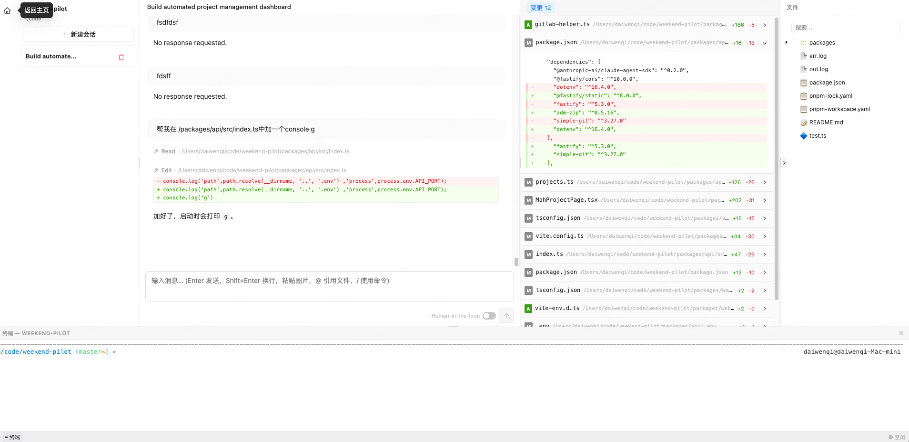

[English](./README.en.md) | 简体中文

# Claude Web

[](https://github.com/dwqdaiwenqi/claude-code-web/blob/main/LICENSE)


将 [Claude Code Agent SDK](https://www.npmjs.com/package/@anthropic-ai/claude-agent-sdk) 封装为 **REST/SSE HTTP 服务**，并附带开箱即用的 Web 界面。

**任何语言、任何平台**都可以通过 HTTP 接口驱动 Claude Code，无需关心 SDK 细节。

> **前提**：已安装并登录 Claude Code CLI（`claude` 命令可用）

<image src="./docs/preview1.gif" style="margin:0 auto;width:900px;"/>

---

## 为什么用 Claude Web？

```
你的代码 / 脚本 / 工作流
        │  HTTP / SSE
        ▼
  claude-web server          ← 本项目
        │
        ▼
 Claude Code Agent SDK
        │
        ▼
     Claude API
```

- **API 优先**：对外暴露干净的 REST + SSE 接口，curl / Python / Node / 任何 HTTP 客户端直接调用
- **零数据库**：直接复用 Claude CLI 原生 JSONL 格式，无需额外运维
- **Web UI 内置**：同一个进程同时提供 API 和可视化界面，部署极简
- **流式输出**：SSE 实时推送 Claude 的思考过程和工具调用

---

## 用任意语言调用 Claude Code

### 阻塞模式

等待 Agent 完全执行后一次性返回所有消息。

```bash
curl -X POST http://127.0.0.1:8003/api/session/new/message \
  -H "Content-Type: application/json" \
  -d '{"cwd": "/your/project", "prompt": "看看项目的架构"}'
```

**返回结构**

```js
{
  "sessionId": "xxxxxxxx",
  "messages": [
    { "type": "assistant", "message": {} },
    { "type": "assistant", "message": {} },
    { "type": "user", "message": {} }
    // ...
  ],
  "tokens": { "input": 100, "output": 200, "cache": { "read": 0, "write": 0 } }
}
```

**Python**

```python
import requests

resp = requests.post("http://127.0.0.1:8003/api/session/new/message", json={
    "cwd": "/your/project",
    "prompt": "看看项目的架构",
})
print(resp.json()["messages"][-1])
```

**Node.js**

```js
const res = await fetch('http://127.0.0.1:8003/api/session/new/message', {
  method: 'POST',
  headers: { 'Content-Type': 'application/json' },
  body: JSON.stringify({ cwd: '/your/project', prompt: '看看项目的架构' }),
}).then((r) => r.json())

console.log(res.messages)
```

---

### 非阻塞模式（SSE）

加 `?stream=1` 和 `Accept: text/event-stream` 请求头，消息实时逐条推送。

```bash
curl -N -X POST "http://127.0.0.1:8003/api/session/new/message?stream=1" \
  -H "Content-Type: application/json" \
  -H "Accept: text/event-stream" \
  -d '{"cwd": "/your/project", "prompt": "看看项目的架构"}'
```

**返回数据流**

```
event: message
data: {"type":"assistant","message":{...}}

event: message
data: {"type":"user","message":{...}}

// ...

event: done
data: {"sessionId":"xxx","cost":0.001,"tokens":{...}}
```

- `message` 事件：每产生一条 assistant 消息或工具调用结果就推送一次，会来多次
- `done` 事件：Agent 执行完毕时发送一次，携带 sessionId 和费用信息，之后连接关闭

**Node.js**（使用 [eventsource-parser](https://github.com/rexxars/eventsource-parser)）

```js
import { createParser } from 'eventsource-parser'

const response = await fetch('http://127.0.0.1:8003/api/session/new/message?stream=1', {
  method: 'POST',
  headers: {
    'Content-Type': 'application/json',
    Accept: 'text/event-stream',
  },
  body: JSON.stringify({ cwd: '/your/project', prompt: '看看项目的架构' }),
})

const parser = createParser({
  onEvent(ev) {
    const payload = JSON.parse(ev.data)
    if (ev.event === 'message') {
      const blocks = payload.message?.content ?? []
      for (const block of blocks) {
        if (block.type === 'text') process.stdout.write(block.text)
      }
    }
    if (ev.event === 'done') {
      console.log('\n[done]', `sessionId=${payload.sessionId}`, `cost=$${payload.cost?.toFixed(5)}`)
    }
  },
})

const reader = response.body.getReader()
const decoder = new TextDecoder()
while (true) {
  const { done, value } = await reader.read()
  if (done) break
  parser.feed(decoder.decode(value, { stream: true }))
}
```

---

## 快速开始

**1. 安装**

```bash
npm install -g @claude-web/server
```

**2. 启动服务**

```bash
claude-web start

→ server: http://127.0.0.1:8003
→ docs:   http://127.0.0.1:8003/docs
```

**3. 打开 Web UI**

访问 http://127.0.0.1:8003

首页显示所有已链接的项目：


点击项目后进入会话页：




---

## Web UI 特性

#### 富文本输入框

<image src="./docs/preview3.gif" style="margin:0 auto;width:900px;"/>

| 功能          | 说明                                                               |
| ------------- | ------------------------------------------------------------------ |
| `@` 文件引用  | 输入 `@` 搜索并引用项目内任意文件，路径自动注入到 prompt           |
| `/` 斜杠命令  | `/init` 生成 CLAUDE.md、`/cost` 查看 Token 消耗、`/clear` 清空会话 |
| 图片粘贴      | `Ctrl+V` / `Cmd+V` 直接粘贴截图，自动转 base64（多模态）           |
| `Shift+Enter` | 换行而不触发发送                                                   |

#### 内置终端

连接到项目目录的交互式终端，无需切换窗口。

## REST API

完整文档：Swagger → http://127.0.0.1:8003/docs


---

## 详细文档

- [packages/server/README.md](./packages/server/README.md) — REST API 服务
- [packages/web/README.md](./packages/web/README.md) — Web UI

## License

MIT
