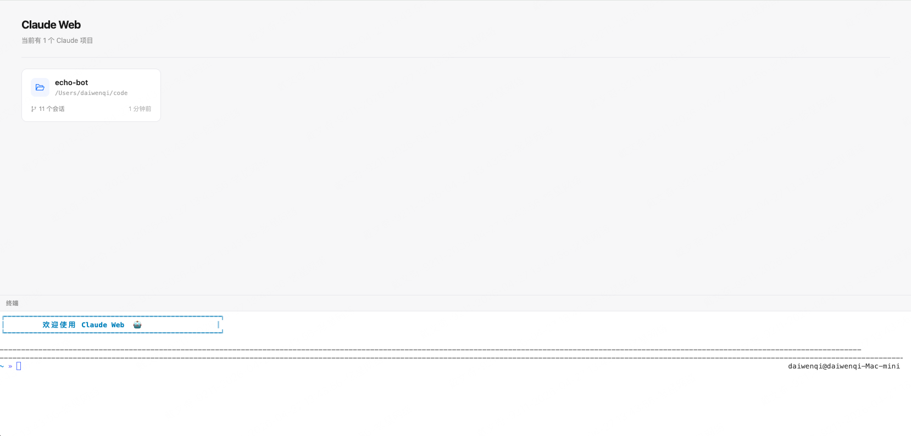

[English](./README.en.md) | 简体中文

# Claude Web

[](https://github.com/dwqdaiwenqi/claude-code-web/blob/main/LICENSE)


将 [Claude Code Agent SDK](https://www.npmjs.com/package/@anthropic-ai/claude-agent-sdk) 封装为 **REST/SSE HTTP 服务**，并附带开箱即用的 Web 界面。

**任何语言、任何平台**都可以通过 HTTP 接口驱动 Claude Code，无需关心 SDK 细节。

> **前提**：已安装并登录 Claude Code CLI（`claude` 命令可用）

<image src="./docs/preview1.gif" style="margin:0 auto;width:900px;"/>

---

## 为什么用 Claude Web？

```
你的代码 / 脚本 / 工作流
        │  HTTP / SSE
        ▼
  claude-web server          ← 本项目
        │
        ▼
 Claude Code Agent SDK
        │
        ▼
     Claude API
```

- **API 优先**：对外暴露干净的 REST + SSE 接口，curl / Python / Node / 任何 HTTP 客户端直接调用
- **零数据库**：直接复用 Claude CLI 原生 JSONL 格式，无需额外运维
- **Web UI 内置**：同一个进程同时提供 API 和可视化界面，部署极简
- **流式输出**：SSE 实时推送 Claude 的思考过程和工具调用

---

### 用任意语言调用 Claude Code

用 curl / Python 直接发 HTTP 请求：

```bash
# 新建会话，让 Claude 帮你分析代码
curl -X POST 'http://127.0.0.1:8003/api/session/new/message' \
  -H 'Content-Type: application/json' \
  -d '{"cwd":"/your/project","prompt":"帮我找出这个项目里所有潜在的内存泄漏"}'
```

```python
# Python 示例
import requests, json

resp = requests.post("http://127.0.0.1:8003/api/session/new/message", json={
    "cwd": "/your/project",
    "prompt": "帮我写完整的单元测试覆盖 src/utils.py"
})
print(resp.json()["messages"][-1])
```

```js
// Node.js 示例
const response = await fetch('http://127.0.0.1:8003/api/session/new/message', {
  method: 'POST',
  headers: { 'Content-Type': 'application/json', Accept: 'text/event-stream' },
  body: JSON.stringify({ cwd: '/your/project', prompt: '帮我重构 src/index.js' }),
}).then((res) => res.json())

console.log(response)
```

---

## 快速开始

**1. 安装**

```bash
npm install -g @claude-web/server
```

**2. 启动服务**

```bash
claude-web start

→ server: http://127.0.0.1:8003
→ docs:   http://127.0.0.1:8003/docs
```

**3. 打开 Web UI**

访问 http://127.0.0.1:8003

首页显示所有已链接的项目：



点击项目后进入会话页：


---

## Web UI 特性

#### 富文本输入框

<image src="./docs/preview3.gif" style="margin:0 auto;width:900px;"/>

| 功能          | 说明                                                               |
| ------------- | ------------------------------------------------------------------ |
| `@` 文件引用  | 输入 `@` 搜索并引用项目内任意文件，路径自动注入到 prompt           |
| `/` 斜杠命令  | `/init` 生成 CLAUDE.md、`/cost` 查看 Token 消耗、`/clear` 清空会话 |
| 图片粘贴      | `Ctrl+V` / `Cmd+V` 直接粘贴截图，自动转 base64（多模态）           |
| `Shift+Enter` | 换行而不触发发送                                                   |

#### 内置终端

连接到项目目录的交互式终端，无需切换窗口。

## REST API

完整文档：Swagger → http://127.0.0.1:8003/docs


---

## 详细文档

- [packages/server/README.md](./packages/server/README.md) — REST API 服务
- [packages/web/README.md](./packages/web/README.md) — Web UI

## License

MIT
